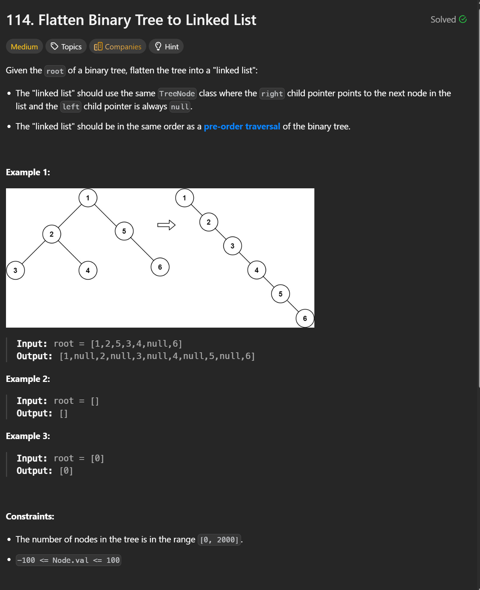

```cpp
class Solution {
public:
    void flatten(TreeNode* root) {

        // Start from the root and iterate through the tree
        TreeNode* curr = root;

        // Iterate until we reach the end of the flattened list
        while (curr) {

            // If the current node has a left subtree
            if (curr->left) {

                // Find the rightmost node in the left subtree
                // (this is where we will attach the original right subtree)
                TreeNode* prev = curr->left;
                while (prev->right) {
                    prev = prev->right;
                }

                // Attach the original right subtree to the rightmost node
                // of the left subtree
                prev->right = curr->right;

                // Move the entire left subtree to the right side
                curr->right = curr->left;

                // Set the left pointer to null as required by the problem
                curr->left = nullptr;
            }

            // Move to the next node in the flattened list
            curr = curr->right;
        }
    }
};

```


Time & Space Complexity

Time Complexity:
O(N)
Each node is visited a constant number of times.

Space Complexity:
O(1) (excluding recursion stack, since this solution is fully iterative)
The tree is flattened in place using only pointer rewiring.