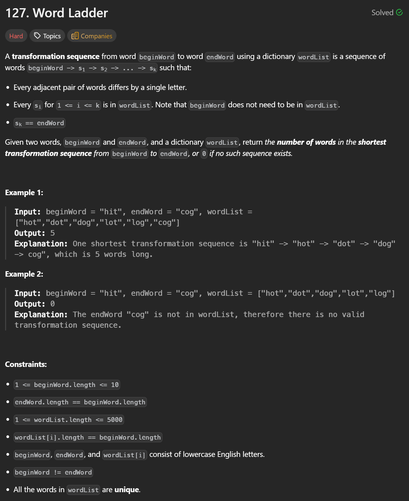

## Word Ladder (BFS) 


```cpp
class Solution {
public:
    int ladderLength(string beginWord, string endWord, vector<string>& wordList) {
        // Put all words into a hash set for O(1) lookup
        unordered_set<string> set(wordList.begin(), wordList.end());

        // If endWord is not in the dictionary, transformation is impossible
        if (!set.count(endWord)) return 0;

        // BFS queue storing current words at each level
        queue<string> q;
        q.push(beginWord);

        // Number of transformation steps (levels in BFS)
        int steps = 1;

        // Standard BFS loop
        while (!q.empty()) {
            int size = q.size();  // Number of nodes in current BFS level

            // Process one BFS level at a time
            while (size--) {
                string curr = q.front();
                q.pop();

                // If we reach the end word, return the number of steps
                if (curr == endWord) return steps;

                // Try changing each character in the current word
                for (int i = 0; i < curr.size(); i++) {
                    string next = curr;

                    // Replace position i with every letter from 'a' to 'z'
                    for (char c = 'a'; c <= 'z'; c++) {
                        next[i] = c;

                        // If the transformed word exists in the set
                        if (set.count(next)) {
                            // Remove it to avoid revisiting
                            set.erase(next);
                            // Push into queue for next BFS level
                            q.push(next);
                        }
                    }
                }
            }

            // Move to the next transformation step
            steps++;
        }

        // If endWord is never reached
        return 0;
    }
};
```

---

### Key Idea

This problem is solved using **Breadth-First Search (BFS)**.  
Each word is treated as a node, and an edge exists between two words if they differ by exactly one character.

- BFS guarantees that the **first time we reach `endWord`, it is the shortest transformation sequence**.
- The `unordered_set` serves two purposes:
  - Fast lookup to check valid transformations.
  - Acts as a **visited set** by erasing words once used.

---

### Why BFS Works Here

- Each transformation changes exactly one character → uniform edge weight.
- BFS explores all words with the same transformation length before moving deeper.
- Therefore, the first time we reach `endWord`, the path length is minimal.

---

### Time Complexity

Let:
- \( N \) = number of words in `wordList`
- \( L \) = length of each word

For each word, we try:
- \( L \) positions
- 26 possible character replacements

**Time Complexity:**  

O(N * L * 26) = O(N)


---

### Space Complexity

- `unordered_set` stores up to \( N \) words
- BFS queue can also hold up to \( N \) words in the worst case

**Space Complexity:**  
\[
O(N)
\]
