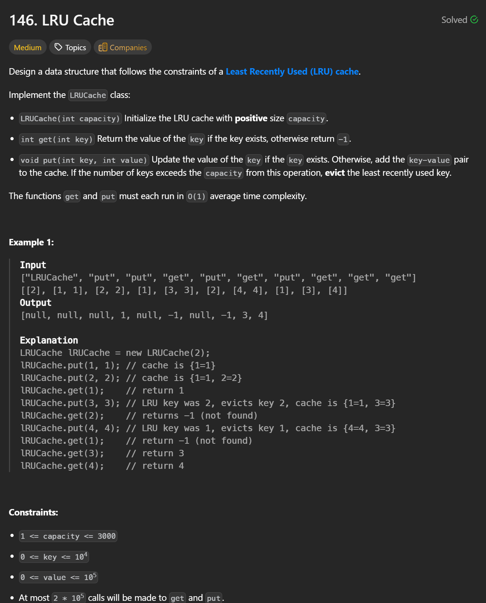

```cpp
struct Node {
    int key;
    int value;
    Node* prev = nullptr;
    Node* next = nullptr;
    Node(int k, int v) : key(k), value(v) {}
};

class DoublyLinkedList {
public:
    Node* head = nullptr;
    Node* tail = nullptr;
    int length = 0;

    /*
    Allocate a new node → O(1)
    Pointer updates (tail->next, curr->prev, tail = curr) → O(1)
    No traversal
    */
    Node* insert(int key, int value) {
        Node* curr = new Node(key, value);

        if(!head && !tail) {
            head = curr;
            tail = curr; 
        } else {
            tail->next = curr;
            curr->prev = tail;
            tail = curr;
        }
        length++;
        return curr;
    }

    /*
    Pointer rewiring using node->prev and node->next

    No iteration or traversal

    Time Complexity: O(1)
    */

    void remove(Node* node) {
        
        if(!node->prev && !node->next) {
            head = nullptr;
            tail = nullptr;
        } else if(!node->prev) {
            head = node->next;
            head->prev = nullptr;
        } else if(!node->next) {
            tail = node->prev;
            tail->next = nullptr;
        } else {
            Node* p = node->prev;
            Node* n = node->next;
            p->next = n;
            n->prev = p;
        }
        length--;
        delete node;
    }
};

class LRUCache {
public:
    int capacity;
    DoublyLinkedList DLL;
    unordered_map<int, Node*> map;

    LRUCache(int capacity) {
        this->capacity = capacity;
    }

    /*
    map.count(key): Hash lookup → O(1) average

    map[key]: Hash lookup → O(1) average

    DLL.remove(node): Constant pointer manipulation → O(1)

    DLL.insert(key, val): Constant pointer manipulation → O(1)

    Update map[key]: Hash insert/update → O(1) average

    Total Time Complexity: O(1) average
    */
    int get(int key) {
        if(!map.count(key)) return -1;
        int val = map[key]->value;
        DLL.remove(map[key]);
        map[key] = DLL.insert(key, val);
        return val;
    }

    /*
    Case 1: Key already exists:
    - map.count(key) → O(1)
    - DLL.remove(node) → O(1)

    Case 2: Cache is full:
    - Access DLL.head → O(1)
    -map.erase(lru_key) → O(1) average
    -DLL.remove(head) → O(1)

    Final insertion:
    - DLL.insert(key, value) → O(1)
    - map[key] = node → O(1)

    Total Time Complexity: O(1) average
    */
    void put(int key, int value) {
        if(map.count(key)) {
            DLL.remove(map[key]);
        }
        map[key] = DLL.insert(key, value);
        if(capacity == DLL.length) {
            int lru_key = DLL.head->key;
            map.erase(lru_key);
            DLL.remove(DLL.head);
        }
    }
};
```