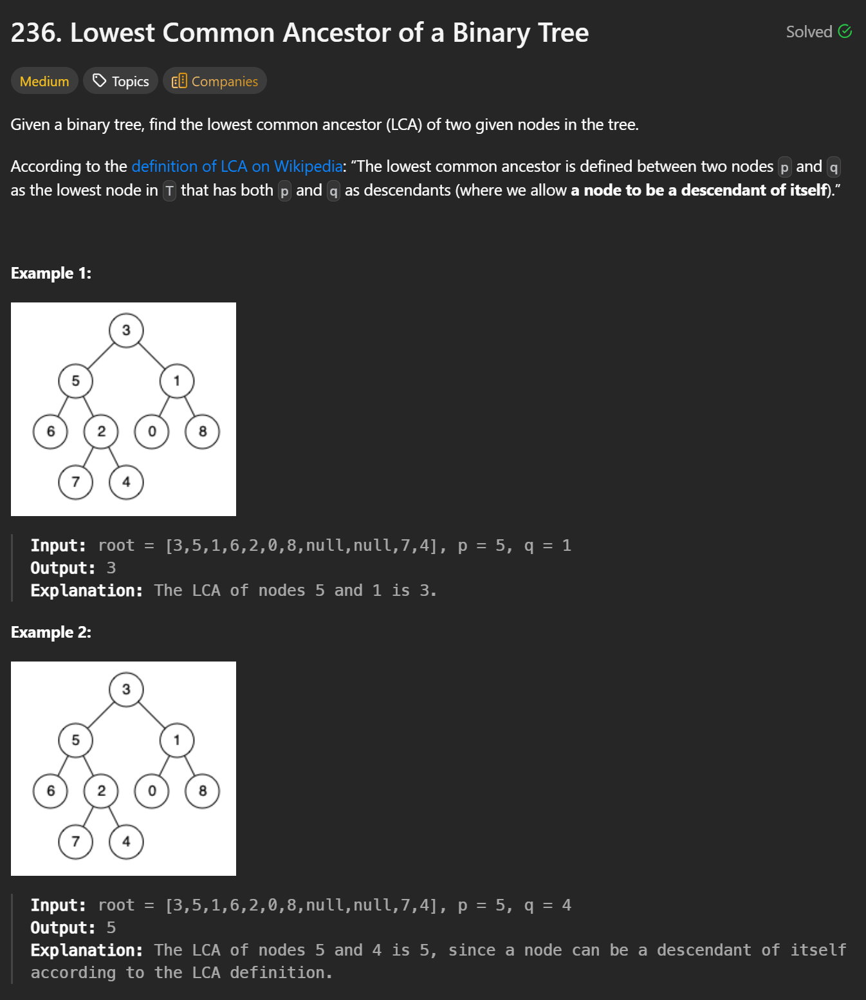
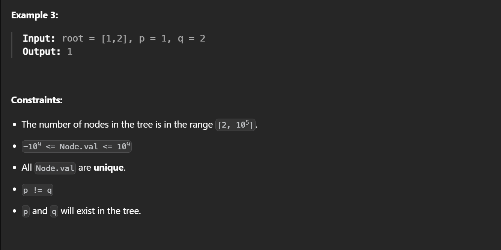

```cpp
/**
 * Definition for a binary tree node.
 * struct TreeNode {
 *     int val;
 *     TreeNode *left;
 *     TreeNode *right;
 *     TreeNode(int x) : val(x), left(NULL), right(NULL) {}
 * };
 */
class Solution {
public:
    TreeNode* lowestCommonAncestor(TreeNode* root, TreeNode* p, TreeNode* q) {
        // Base case: if we hit null, or we found p, or we found q,
        // return it upward as a "found signal".
        if (root == nullptr || root == p || root == q) return root;

        // Search left subtree for p/q
        TreeNode* left = lowestCommonAncestor(root->left, p, q);

        // Search right subtree for p/q
        TreeNode* right = lowestCommonAncestor(root->right, p, q);

        // If p/q are found in different subtrees, current root is the LCA
        if (left != nullptr && right != nullptr) return root;

        // Otherwise, return the non-null side (still propagating the found node / LCA)
        return (left != nullptr) ? left : right;
    }
};

```

Time Complexity: O(N)  
Each node in the tree is visited at most once during the DFS, so the total time complexity is linear in the number of nodes N.

---
Space Complexity: O(H)  
The space is used by the recursion call stack, where H is the height of the tree.
In the worst case (a skewed tree), H = N; in a balanced tree, H = log N.