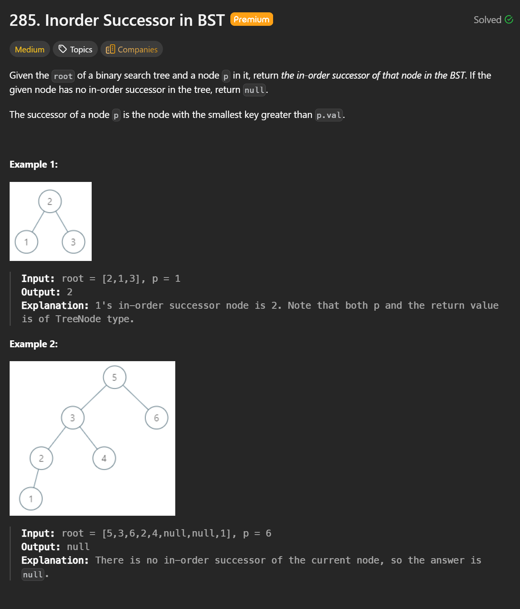
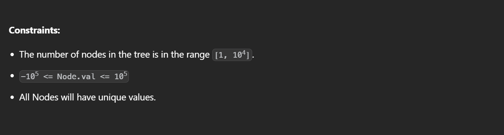

# 285. Inorder Successor in BST

## Problem Overview

Given the root of a **Binary Search Tree (BST)** and a node `p` in the tree, return the **in-order successor** of `p`.

- The in-order successor of a node is the node with the **smallest value strictly greater than `p.val`**
- If no such node exists, return `null`

---

## Key Insight

Because the tree is a **BST**, we do **not** need to perform a full inorder traversal.

> The problem reduces to finding the **minimum value greater than `p.val`**  
> This is equivalent to performing a **lower bound search** in a BST.

---

## Optimal Approach (Iterative)

We traverse the tree starting from `root` and maintain a candidate successor.

### Strategy

- If `curr.val > p.val`
  - `curr` is a valid successor candidate
  - Save it
  - Move to the **left subtree** to find a smaller valid successor
- Else (`curr.val <= p.val`)
  - The successor must be in the **right subtree**
  - Move right

---

## Algorithm Steps

1. Initialize `ans = nullptr`
2. Set `curr = root`
3. While `curr` is not null:
   - If `curr.val > p.val`:
     - Update `ans = curr`
     - Move to `curr.left`
   - Else:
     - Move to `curr.right`
4. Return `ans`

---

## C++ Implementation

```cpp
/**
 * Definition for a binary tree node.
 * struct TreeNode {
 *     int val;
 *     TreeNode *left;
 *     TreeNode *right;
 *     TreeNode(int x) : val(x), left(nullptr), right(nullptr) {}
 * };
 */
class Solution {
public:
    TreeNode* inorderSuccessor(TreeNode* root, TreeNode* p) {
        TreeNode* res = nullptr;
        TreeNode* curr = root;

        while (curr) {
            if (curr->val > p->val) {
                res = curr;          // candidate successor
                curr = curr->left;   // try to find a smaller one
            } else {
                curr = curr->right;  // must go right to find larger values
            }
        }
        return res;
    }
};
```

---

## Why This Works

- Any node with value `<= p.val` **cannot** be the inorder successor
- Every node with value `> p.val` is a **valid candidate**
- Moving left ensures we find the **smallest** such candidate
- This approach avoids unnecessary traversal and extra memory usage

---

## Complexity Analysis

- **Time Complexity:** `O(h)`
  - `h` is the height of the tree
  - Balanced BST: `O(log n)`
  - Worst case (skewed tree): `O(n)`
- **Space Complexity:** `O(1)`

---

## Interview Summary (One-Liner)

> “Since this is a BST, we can find the inorder successor using a lower-bound style search in `O(h)` time and `O(1)` space, without doing a full inorder traversal.”

---
