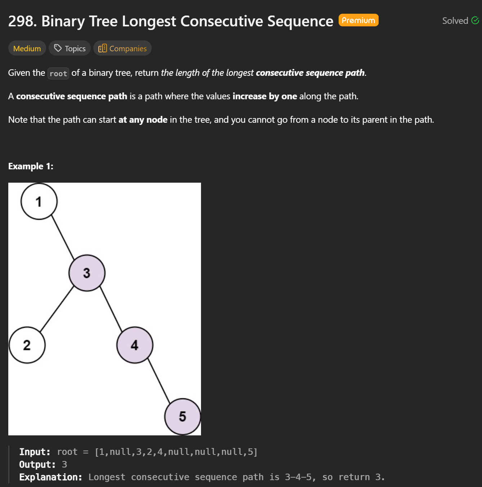
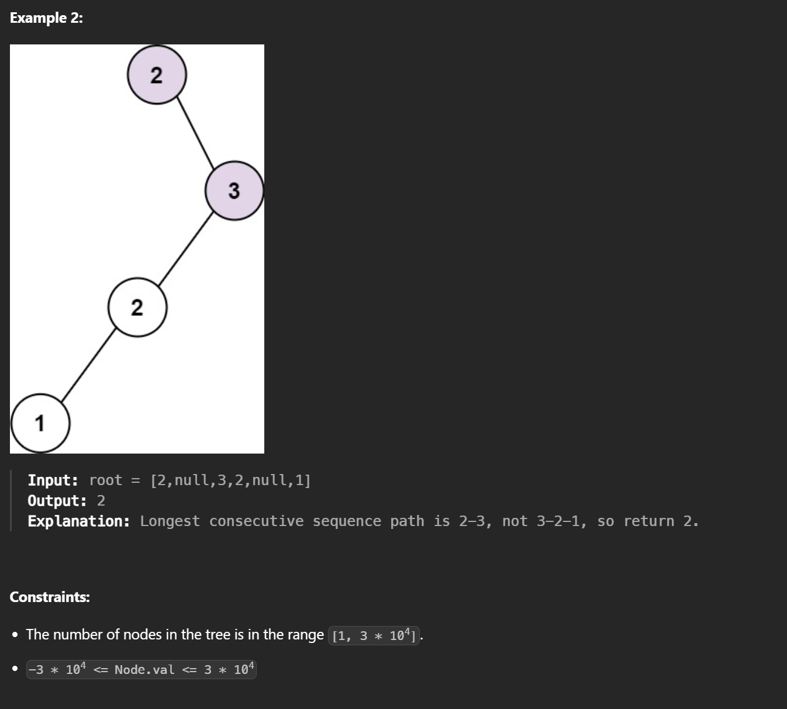

## 298. Binary Tree Longest Consecutive Sequence — DFS + Parent Pointer

### Idea 

We traverse the tree using **DFS**.  
For each node, we check whether its value is exactly **parent value + 1**.

- If yes → the consecutive sequence continues, increase the length
- If no → the sequence breaks, restart the length from **1**
- While traversing, keep updating the global maximum length

The path can **only go downward (parent → child)**, so DFS is a natural fit.

---

### Code Walkthrough (Based on Your Code)

```cpp
int res = 0;
```
- `res` stores the **maximum length** of any consecutive sequence found so far.

---

```cpp
function<void(TreeNode*, TreeNode*, int)> dfs = ...
```
The DFS lambda takes:
- `node`   → current node
- `parent`→ parent of current node (used for comparison)
- `currLen` → length of the current consecutive sequence

---

```cpp
if (!node) return;
```
- Base case: stop when reaching a null node.

---

```cpp
if (parent && node->val == parent->val + 1) {
    currLen++;
} else {
    currLen = 1;
}
```
- If the current value is exactly `parent + 1`, extend the sequence
- Otherwise, reset the sequence length to 1 (start a new path here)

---

```cpp
res = max(res, currLen);
```
- Update the global maximum length.

---

```cpp
dfs(node->left, node, currLen);
dfs(node->right, node, currLen);
```
- Continue DFS on both children
- Pass the current node as the parent

---

```cpp
dfs(root, nullptr, 0);
```
- Start DFS from the root
- Root has no parent, so the first node will always start a sequence of length 1

---

### Full Code
```cpp

/**
 * Definition for a binary tree node.
 * struct TreeNode {
 *     int val;
 *     TreeNode *left;
 *     TreeNode *right;
 *     TreeNode() : val(0), left(nullptr), right(nullptr) {}
 *     TreeNode(int x) : val(x), left(nullptr), right(nullptr) {}
 *     TreeNode(int x, TreeNode *left, TreeNode *right) : val(x), left(left), right(right) {}
 * };
 */
class Solution {
public:
    int longestConsecutive(TreeNode* root) {
        int res = 0;

        function<void(TreeNode*,TreeNode*,int)> dfs = [&](TreeNode* node, TreeNode* parent, int currLen) {
            if(!node) return;
            if(parent && node->val == parent->val + 1) {
                currLen ++;
            } else {
                currLen = 1;
            }
            res = max(res, currLen);
            dfs(node->left, node, currLen);
            dfs(node->right, node, currLen);
        };

        dfs(root, nullptr, 0);
        return res;
    }
};
```

### Why This Solution Is Optimal

- Every node is visited **exactly once**
- No extra data structures are used
- The logic directly matches the problem constraint: **only parent → child paths**

---

### Time Complexity

**O(n)**  
- `n` is the number of nodes
- Each node is processed once

---

### Space Complexity

**O(h)**  
- `h` is the height of the tree
- Space is used by the recursion stack
- Worst case (skewed tree): `O(n)`
- Balanced tree: `O(log n)`

---

### Key Takeaway

This solution is:
- Time-optimal
- Space-optimal for DFS
- Clear and interview-friendly
- Easy to reason about due to explicit parent comparison
