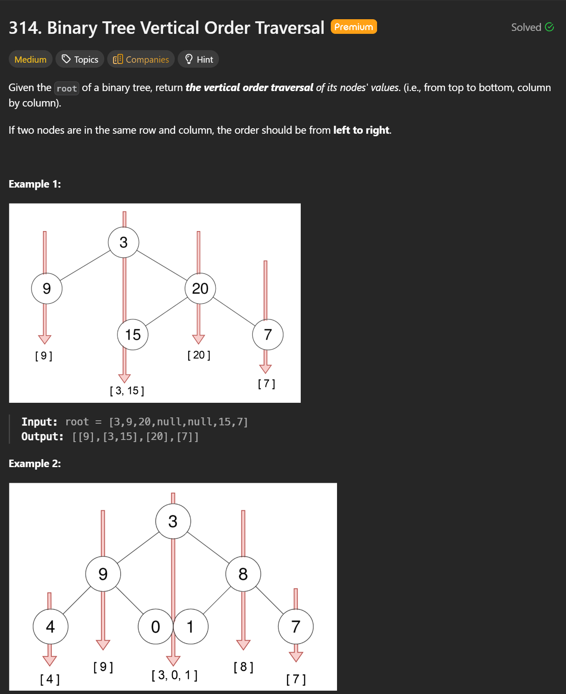
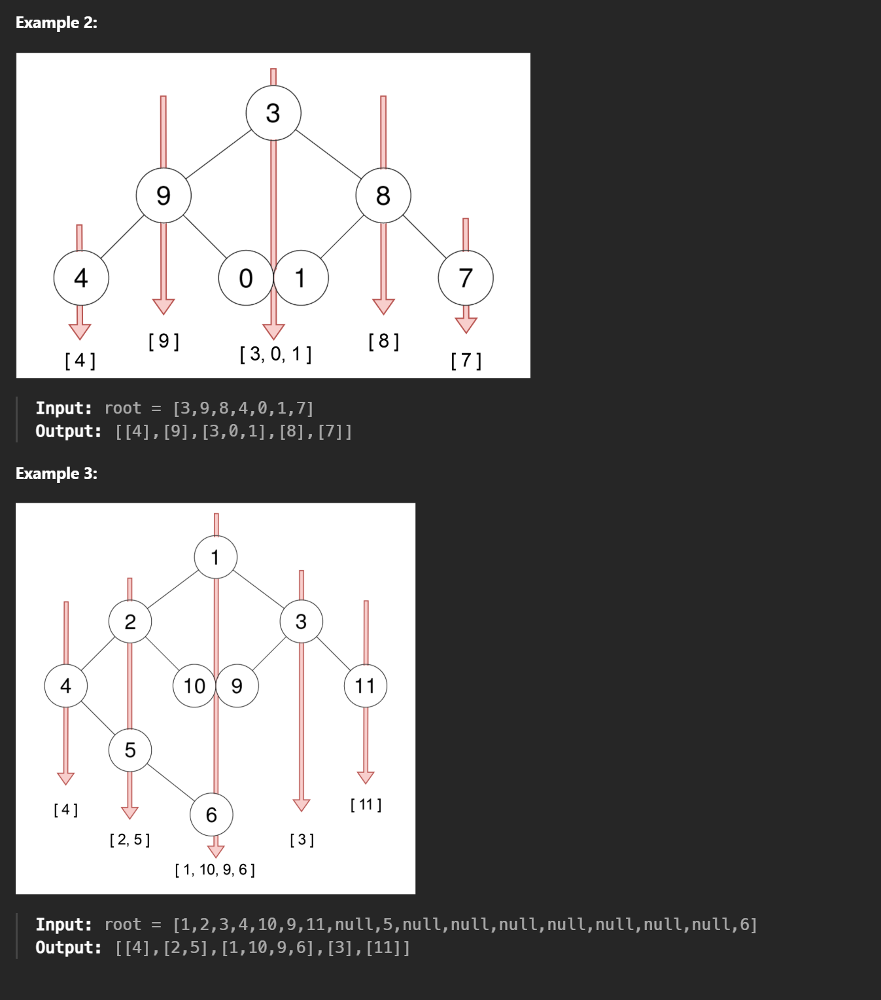
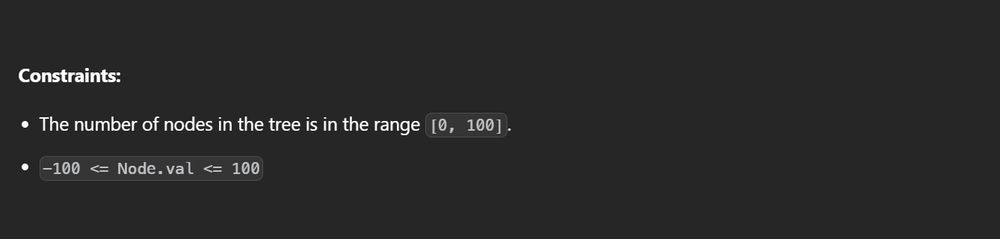

## 314. Binary Tree Vertical Order Traversal — BFS Optimal Solution


```cpp
/**
 * Definition for a binary tree node.
 * struct TreeNode {
 *     int val;
 *     TreeNode *left;
 *     TreeNode *right;
 *     TreeNode(int x) : val(x), left(nullptr), right(nullptr) {}
 * };
 */
class Solution {
public:
    vector<vector<int>> verticalOrder(TreeNode* root) {
        // Edge case: empty tree
        if (!root) return {};

        // Hash map: column index -> values in that column (top to bottom)
        unordered_map<int, vector<int>> map;

        // BFS queue storing (node, column index)
        queue<pair<TreeNode*, int>> q;
        q.push({root, 0});  // root starts at column 0

        // Track the leftmost and rightmost columns seen
        int minCol = 0;
        int maxCol = 0;

        // Standard BFS traversal
        while (!q.empty()) {
            auto [node, col] = q.front();
            q.pop();

            // Append current node value to its column
            map[col].push_back(node->val);

            // Update column boundaries
            minCol = min(minCol, col);
            maxCol = max(maxCol, col);

            // Left child goes to column - 1
            if (node->left)
                q.push({node->left, col - 1});

            // Right child goes to column + 1
            if (node->right)
                q.push({node->right, col + 1});
        }

        // Build the result from leftmost column to rightmost column
        vector<vector<int>> res;
        for (int i = minCol; i <= maxCol; i++) {
            res.push_back(map[i]);
        }

        return res;
    }
};
```

---

## Key Idea 

This problem is solved optimally using **Breadth-First Search (BFS)** combined with a **column index**:

- Each node is assigned a column number:
  - Root → column `0`
  - Left child → `col - 1`
  - Right child → `col + 1`
- BFS is crucial because:
  - It processes nodes **top to bottom**
  - Nodes at the same row and column are visited **left to right**, which matches the problem requirement
- An `unordered_map` groups node values by column
- `minCol` and `maxCol` are tracked to output columns in correct left-to-right order, since `unordered_map` itself is unordered

---

## Time Complexity

- **O(n)**  
  - Each node is visited exactly once
  - Hash map insertions and lookups are **O(1) on average**

---

## Space Complexity

- **O(n)**  
  - `unordered_map` stores all node values
  - BFS queue can hold up to O(n) nodes in the worst case

---