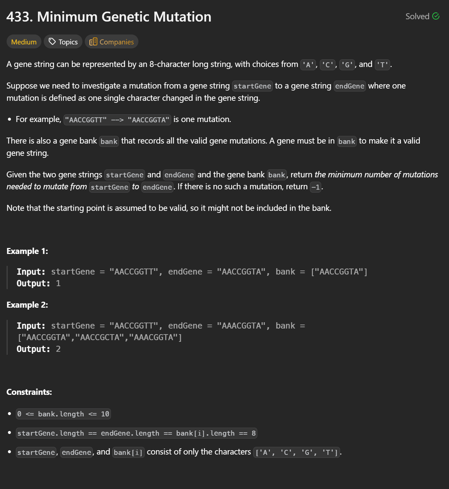

## BFS Solution


```cpp
class Solution {
public:
    int minMutation(string startGene, string endGene, vector<string>& bank) {

        // Convert the bank into a hash set for O(1) lookup and visited tracking
        unordered_set<string> set(bank.begin(), bank.end());

        // If the target gene is not in the bank, it is impossible to reach
        if (!set.count(endGene)) return -1;

        // BFS queue storing gene strings at the current frontier
        queue<string> q;

        // Start BFS from the starting gene (it is assumed to be valid)
        q.push(startGene);

        // All possible gene characters for mutation
        string letters = "ACGT";

        // Number of mutations taken so far (BFS depth)
        int steps = 0;

        // Standard BFS loop
        while (!q.empty()) {

            // Number of nodes (genes) in the current BFS level
            int size = q.size();

            // Process exactly one BFS layer
            while (size--) {

                // Take the next gene from the queue
                string curr = q.front();
                q.pop();

                // If we reached the target gene, return the mutation count
                if (curr == endGene) return steps;

                // Try mutating each position in the current gene
                for (int i = 0; i < curr.size(); i++) {

                    // Create a copy so the original gene is not modified
                    string next = curr;

                    // Try replacing position i with each possible gene letter
                    for (char c : letters) {

                        // Apply the mutation at index i
                        next[i] = c;

                        // If this mutated gene is valid and unvisited
                        if (set.count(next)) {

                            // Mark as visited by removing it from the set
                            set.erase(next);

                            // Add it to the BFS queue for the next level
                            q.push(next);
                        }
                    }
                }
            }

            // Finished processing one BFS level → one mutation step completed
            steps++;
        }

        // If BFS completes without reaching the target gene, return -1
        return -1;
    }
};
```

---

### Notes

#### Why BFS?
- Each mutation has the same cost (1 step).
- We are asked for the **minimum number of mutations**.
- This is an **unweighted shortest-path problem**, which is exactly what BFS solves.

#### Why remove from the set (`set.erase(next)`)?
- It serves as a **visited marker**.
- Ensures each gene in the bank is processed **at most once**.
- Prevents cycles and redundant queue insertions.

#### Why `steps++` after processing a level?
- Each BFS level represents **one mutation step**.
- Incrementing after finishing the level keeps `steps` aligned with mutation depth.

---

### Time Complexity

Let:
- `n` = number of genes in `bank`
- `L` = length of each gene (here `L = 8`)
- Alphabet size = 4 (`A, C, G, T`)

Each gene is visited **once**, and for each gene:
- We try `L × 4` mutations

**Time Complexity:**  
n = number of genes in bank  
L = length of each gene
Alphabet size = 4 (A,G,C,T)  
**Total: O(n * L * 4) = O(n)**

---

### Space Complexity

- Queue can hold up to `O(n)` genes
- Hash set stores up to `O(n)` genes

**Space Complexity: O(n)**

---

### Key Takeaway

This solution uses a **clean, reusable BFS shortest-path template**:
- Level-order traversal
- Hash set for visited nodes
- Clear separation between layers and mutation steps

This exact pattern generalizes to problems like **Word Ladder**, **Open the Lock**, and other shortest-transformation problems.
