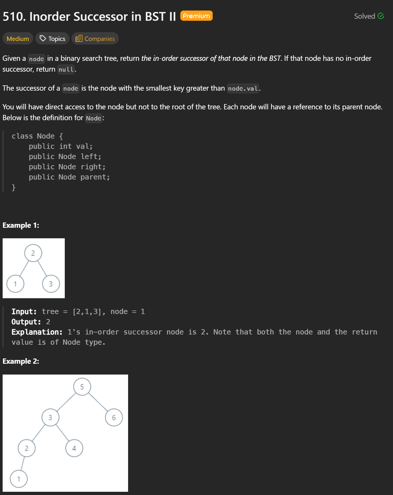
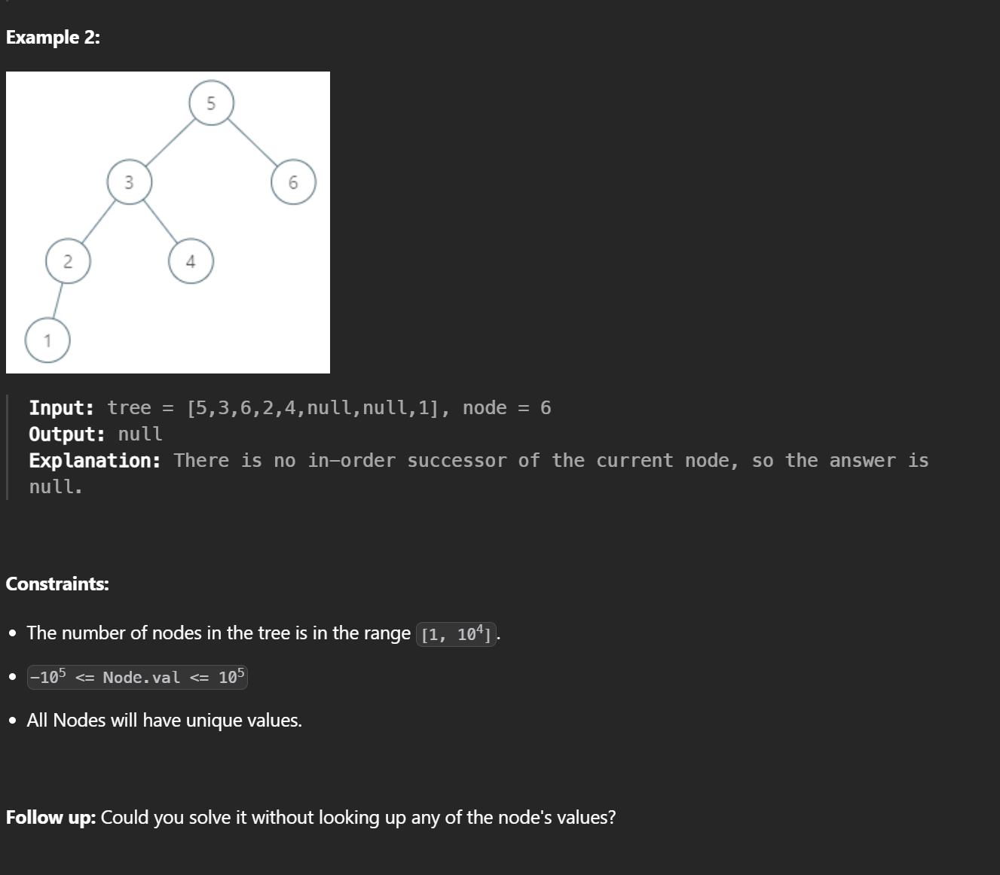

## 510. Inorder Successor in BST II — Optimal Approach

**Goal**  
Given a node in a BST (with `parent` pointer, no root access), return its **inorder successor**  
→ the next node in **inorder traversal**.

---

### Key Insight
The successor depends only on **tree structure**, not on node values.

---

### Case 1: Node has a right subtree
- The successor is the **leftmost node** in the right subtree.
- Reason: Inorder = Left → Node → Right, so the next node comes from the right side.

**Steps**
1. Move to `node.right`
2. Keep going `left` until `null`

---

### Case 2: Node has NO right subtree
- Move **upward using `parent` pointers**
- The successor is the **first ancestor** where:
  - the current node is in the ancestor’s **left** subtree

**Steps**
1. Set `cur = node`
2. While `cur` is the **right child** of its parent:
   - move `cur = parent`
3. That parent is the successor
4. If no such parent exists → `null`

---

```cpp
/*
// Definition for a Node.
class Node {
public:
    int val;
    Node* left;
    Node* right;
    Node* parent;
};
*/

class Solution {
public:
    Node* inorderSuccessor(Node* node) {
        // Case 1: has right subtree -> leftmost node in right subtree
        if(node->right) {
            Node* curr = node->right;
            while(curr->left) {
                curr = curr->left;
            }
            return curr;
        }

        // Case 2: no right subtree -> go up until we come from a left child
        Node* curr = node;
        Node* p = curr->parent;
        while(p && p->right == curr) {
            curr = p;
            p = p->parent;
        }
        return p; // may be nullptr
    }
};
```

---

### Complexity
- **Time:** `O(h)` (tree height)
- **Space:** `O(1)`
- **Follow-up satisfied:** No value comparisons needed

---

### Mental Model
- Right subtree exists → **go right once, then all the way left**
- No right subtree → **climb up until you turn left**
