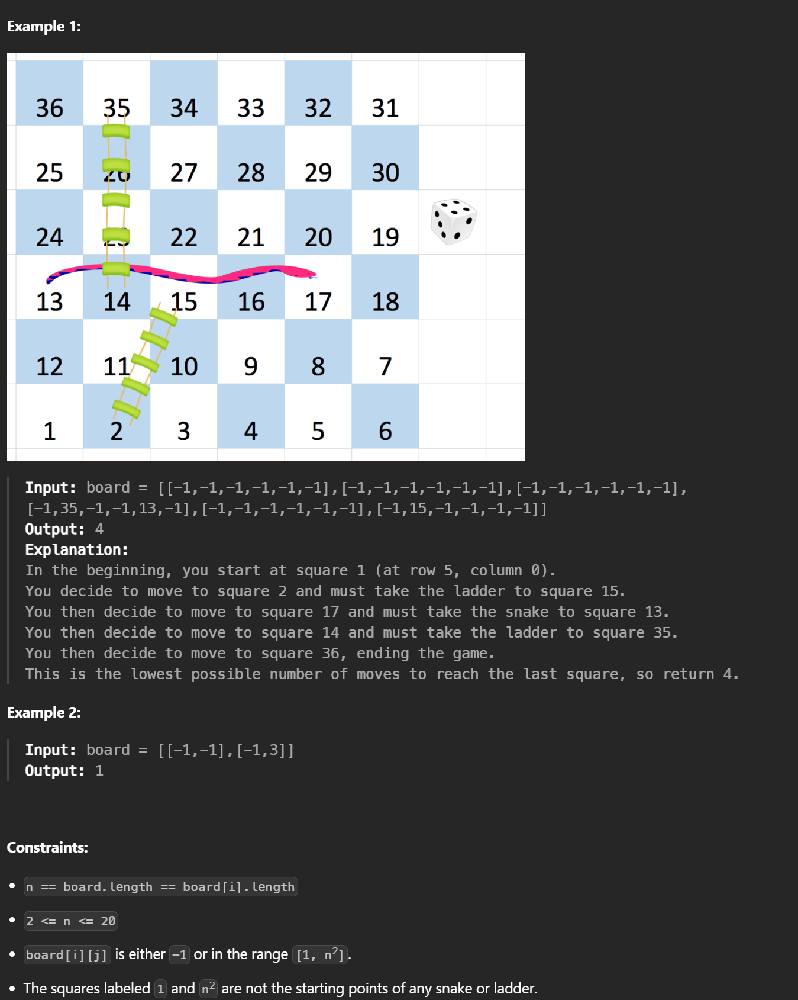

## Core Idea
- Each square (1 → n²) is a node
- Each dice roll (1–6) costs 1 move
- Find minimum moves → **BFS**

BFS works because all edges have equal cost, so the **first time reaching a square is optimal**.

---

## State
- `dist[x]`: minimum dice rolls to reach square `x`
- `-1` means not visited
- Use `n*n + 1` so index matches square number

---

```cpp
class Solution {
public:
    int snakesAndLadders(vector<vector<int>>& board) {
        int n = board.size();
        vector<int> count(n * n + 1, -1);
        count[1] = 0;
        queue<int> q;
        q.push(1);

        while(!q.empty()) {
            int curr = q.front();
            q.pop();
            if(curr == n * n) return count[curr];

            for(int dice = 1; dice <= 6; dice++) {
                int next = curr + dice;
                if(next > n * n) break;
                
                int row = (next - 1) / n;
                int col = (next - 1) % n;
                int actualRow = n - 1 - row;
                if(row % 2 == 1) {
                    col = n - 1 - col;
                }

                if(board[actualRow][col] != -1) {
                    next = board[actualRow][col];
                }

                if(count[next] == -1) {
                    count[next] = count[curr] + 1;
                    q.push(next);
                }
            }
        }
        return -1;
    }
};
```

Complexity

Time: O(n²)

Space: O(n²)