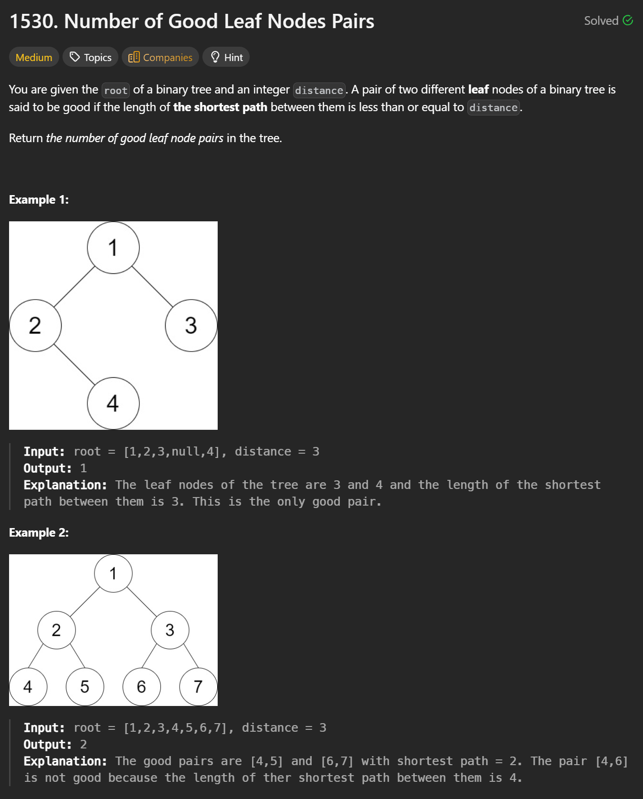
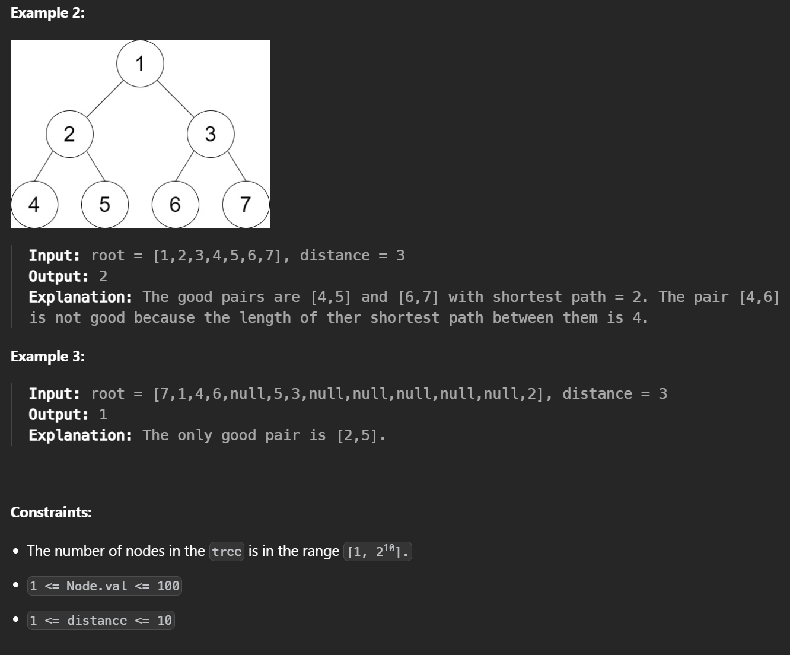

```cpp
class Solution {
public:
    int countPairs(TreeNode* root, int distance) {
        int res = 0;  
        // Global result: number of good leaf pairs

        function<vector<int>(TreeNode*)> dfs = [&](TreeNode* node) {
            vector<int> count(distance + 1, 0);
            // count[d] = number of leaves at distance d from this node

            if (!node) return count;
            // Empty subtree contributes nothing

            if (!node->left && !node->right) {
                count[1] = 1;
                // Leaf node: distance to parent is 1
                return count;
            }

            auto L = dfs(node->left);
            auto R = dfs(node->right);
            // Postorder: get distance distributions from children

            for (int i = 1; i <= distance; i++) {
                for (int j = 1; j <= distance; j++) {
                    if (i + j <= distance) {
                        res += L[i] * R[j];
                        // Combine left and right leaves:
                        // leaf-to-leaf distance = i + j
                    }
                }
            }

            for (int i = 1; i < distance; i++) {
                count[i + 1] = L[i] + R[i];
                // Shift distances by +1 when returning to parent
            }

            return count;
        };

        dfs(root);
        // Traverse the whole tree

        return res;
        // Final number of good leaf pairs
    }
};
```