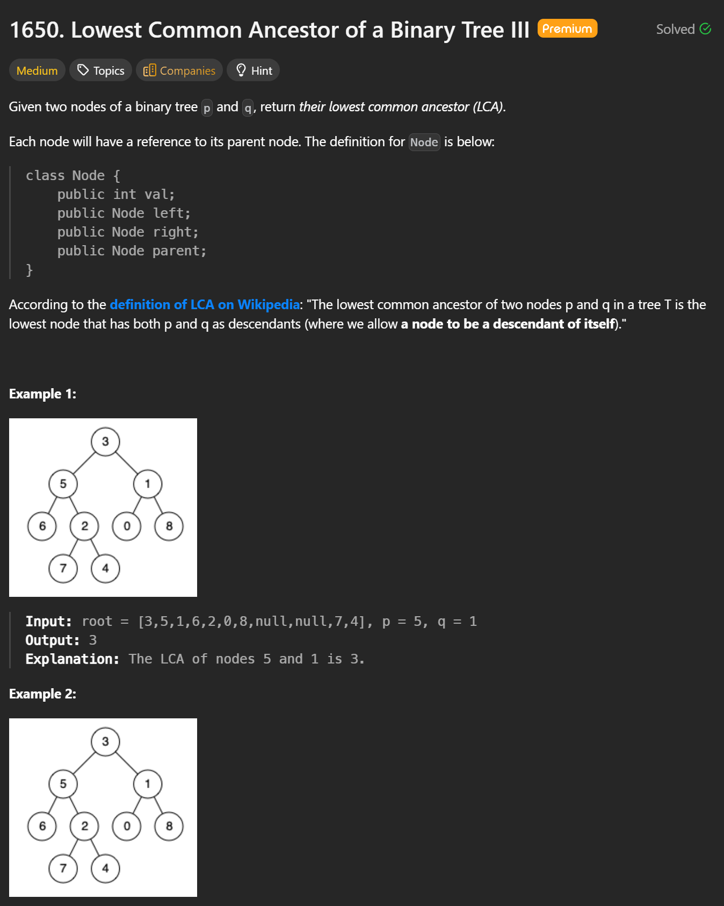
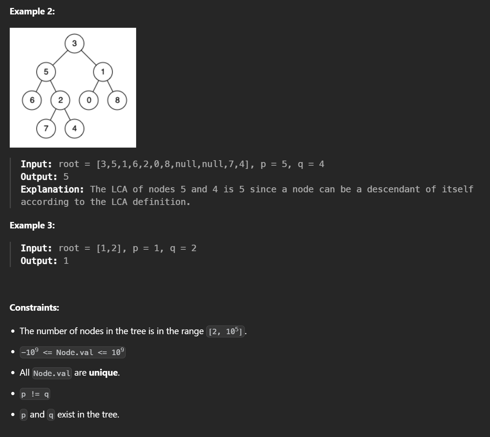

```cpp
/*
// Definition for a Node.
class Node {
public:
    int val;
    Node* left;
    Node* right;
    Node* parent;
};
*/

class Solution {
public:
    Node* lowestCommonAncestor(Node* p, Node* q) {

        // Pointer a starts from node p
        Node* a = p;

        // Pointer b starts from node q
        Node* b = q;

        // Move both pointers upward until they meet
        // They will eventually meet at the LCA
        while (a != b) {

            // If pointer a reaches the top (nullptr),
            // redirect it to start from q
            // This makes a traverse: p -> root -> q -> root
            a = (a == nullptr) ? q : a->parent;

            // If pointer b reaches the top (nullptr),
            // redirect it to start from p
            // This makes b traverse: q -> root -> p -> root
            b = (b == nullptr) ? p : b->parent;
        }

        // When a == b, the node is the Lowest Common Ancestor
        return a; // or return b (they are the same)
    }
};

```

### By switching pointers at nullptr, both pointers traverse the same total path length, automatically aligning depths, so their first meeting point must be the LCA.


Time Complexity: O(h)

h is the height of the tree  
Each pointer traverses at most:  
path from p to root  
path from q to root  


---
Space Complexity: O(1)


No extra data structures   
Only two pointers are used