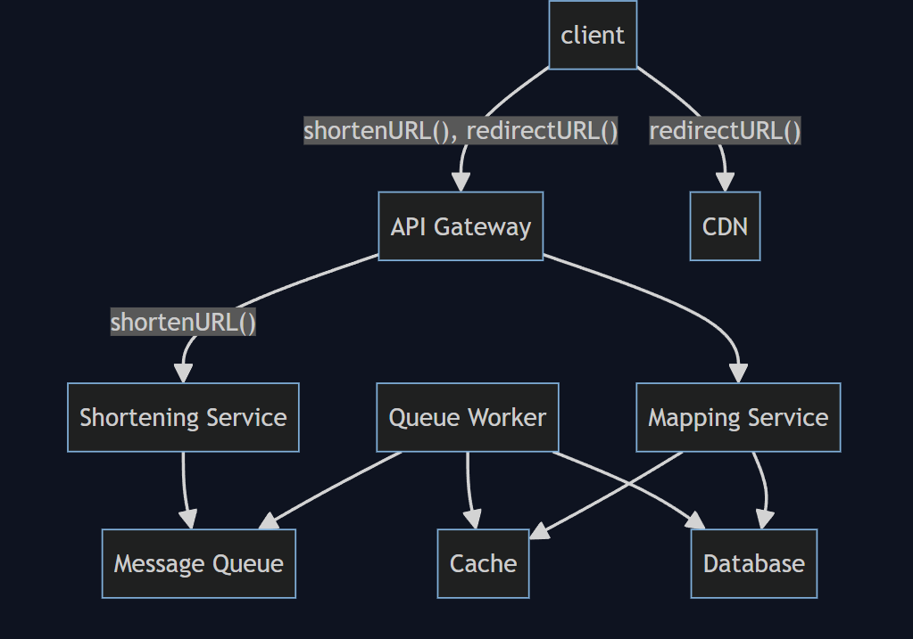

# **Designing a Simple URL Shortening Service — A TinyURL Approach**

## **System requirements**

### **Functional**
- Given a long URL, create an associated short URL.  
- Given a short URL, return the associated long URL.

### **Non-Functional**
- Availability - This service has to be highly available. Especially functionality (2) (redirection).  
- Response time - Functionality (2) has to have low response time, e.g., less than 10ms. Functionality (1) (creating short URL) can takes more time - less than 10 seconds.  
- Scalability - We will get more and more requests to create short URLs, so the storage has to be highly scalable.  

[Generally speaking, you would like to keep the requirements scope small. You only have 35 - 50 min in an interview. If you have a lot of requirements, you'd risk running out of time. We could add other requirements like custom link. But we will start with a small set of requirements. Easier to expand later than shrink.]

---

## **Capacity estimation**

200 requests per second for functionality (1) (creating short URL).  
20,000 requests per second for functionality (2) (redirecting request with a short URL to long URL).  
I assume the random portion of shortened URLs to be 8 characters.  
I also assume long URLs are on average 100 characters.  

Each long -> short URL conversion would include:

- Long URL (100B)  
- Short URL (8B)  
- Created time (8B)  
- Created by user ID (20B)  
- Expiration time (8B)  

Each entry is 144 bytes. We will round it up to 256 bytes.

[You do not have to be exact in this calculation. You can say this object would have these data, and it would roughly be 128 bytes, 256 bytes, 1KB, etc.]

Per day, the service would generate  
`200 * 60 * 60 * 24 * 256 = 4.4GB` of data.  

Within 5 years, it would generate about  
`4.4 * 365 * 5 = 8 TB` of data.  

Considering some growth and some buffer, let's assume it would be **15 TB**.

---

## **API design**

- **shortenURL(str long_url, user_ID, expiration_time=None)**: Takes a long URL and returns a short URL.  
- **redirectURL(str short_url)**: Takes a long URL and returns the associated long URL.

---

## **Database design**

[Junior-level deep dive topic.]

The primary data model for this system is a simple mapping from short URL to a long URL.  
We do not need complex relational query.  
It requires strong consistency.  
Once the short -> long mapping is written, all readers should be able to read it.  

A key-value pair, such as DynamoDB, would fit the bill.  
It is horizontally scalable and performant.  
It can be configured to be strongly consistent.

As discussed above, the data model would be:

- Short URL (8B) - primary key  
- Long URL (100B) - secondary index  
- Created time (8B)  
- Created by user ID (20B) - secondary index  
- Expiration time (8B)  

We may choose to have some secondary indices for additional features.  
Example: secondary index on User ID → list all short URLs created by the user.

---

## **High-level design**

See diagram from the high level architecture.

- API Gateway provides DDoS protection, TLS termination, and forwards requests to right service nodes.
- Shortening Service → creates short URL mappings  
- Mapping Service → handles redirectURL()  
- CDN + Redis cache improve read performance  
- Database stores all mappings  

(shortenURL(), redirectURL(), client → API Gateway → Services → Cache → DB)

---

## **Request flows**

### **shortenURL()**
Client sends the request → API Gateway → Shortening Service → store mapping in DB.

### **redirectURL()**
Client checks CDN → if not found → API Gateway → Mapping Service → Redis Cache → DB.

---

## **Detailed component design**

### **Caching**  
[Mid-level deep dive topic]

redirectURL() needs extremely high performance → caching is critical.

- **CDN:** stores most frequently accessed short → long mappings.  
- **Redis Cache:** larger capacity, inside datacenter.  
- Both use **LRU eviction**.

---

## **Partitioning**
[Mid-level deep dive topic]

Both Cache and Database must be partitioned.

**Partition key: Short URL**  
✔ Fast lookup  
✔ Even distribution (random)  

Other keys (long URL, user ID) cause hotspots.

---

## **Trade offs / Tech choices**

### **Short URL generation**
[Junior-level deep dive topic]

Two choices:

1. Hash long URL  
2. Randomly generate 8-char string  

Pros/cons explained (kept exactly as your text).  
This design picks **random generation**.

---

## **Failure scenarios / bottlenecks**

### **Fault Tolerance**
All components need multiple instances + monitoring.

#### **Failure in Mapping Service**
Use multiple stateless nodes + ZooKeeper for heartbeat detection.

#### **Failure in Cache**
Cache loss increases DB load → cascading failures.

Mitigations include:

- Redis replication  
- Leader election  
- Backoff, rate limiting, circuit breaking  

---

## **Scalability**

### **redirectURL()**
Caching increases scalability significantly.

### **shortenURL()**
High write load → use Message Queue + Queue Worker.

---

## **Future improvements**
- Supporting custom URL.

---
