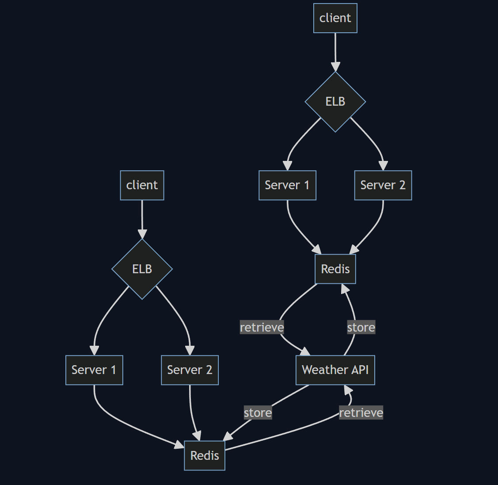

# System requirements

## Functional

List functional requirements for the system (Ask interviewer if stuck)...

- Users expect real-time responses from the service  
- Users fetch weather information and supply a location  

## Non-Functional

- There is a rate limit on the external Weather API  
- Service has to scale to the number of users  
- No need to persist user information and users can access the service without authentication  

## Capacity estimation

Estimate the scale of the system you are going to design...

We expect 10k users interacting with the systems maybe simultaneously  
We will rate limit the service to 1000 requests per hour per user  
If we have 10k users who can send max of 1000 requests per hour, we'll expect an upper bound of 10 million requests per hour.  

---

# API design

Define what APIs are expected from the system...

We will be using HTTPS protocol for this API.

```http
GET /weather?latitude=&longitude=
```

Users will send the latitude and longitude of their current location or whichever location they'd like to get weather information from and the API will respond with a json object containing information, like temperature, AQI, humidity, precipitation, etc. with units in the metric system. A user's latitude and longitude coordinates are likely too granular for the external weather API. We can consider using a range, say within 0.5 miles of a user's coordinates, accurate enough information.

---

# Database design

Defining the system data model early on will clarify how data will flow among different components of the system. Also you could draw an ER diagram using the diagramming tool to enhance your design...

We're not utilizing any relational databases in this design, but we'll use a Redis cache to store Weather API responses. We'll evict entries using the LRU algorithm. The key in the key-value store will be the latitude and longitude of a location with an acceptable threshold. The value will be the response from the Weather API.

---

# High-level design

You should identify enough components that are needed to solve the actual problem from end to end. Also remember to draw a block diagram using the diagramming tool to augment your design...

I'll start by having client requests get routed through an ELB to a number of stateless servers. The servers themselves will handle these GET requests from users and fetch weather information for a specific location from the external weather API. We can consider adding a in-memory cache like Redis between the servers and the external weather API with a short TTL (say, 5 minutes) to help alleviate hitting the external API rate limit.

If we have 10k users who can send max of 1000 requests per hour, we'll expect an upper bound of 10 million requests per hour. We can first try horizontal scaling by automatically increasing the number of servers behind the ELB when we hit bursts of traffic. It is also likely that users will fetch weather information for their current location, so we can consider replicating this service to different geographical locations and route users to their nearest system




---

# Request flows

Explain how the request flows from end to end in your high level design. Also you could draw a sequence diagram using the diagramming tool to enhance your explanation...

For the end to end flow, a user will make an unauthenticated HTTPS request to the service. They'll send along their longitude and latitude coordinates in the GET request. A stateless server will accept the request and make a read-through request to Redis. If there is fresh information in the cache. If there's a data point in the cache that is within the acceptable range of a user's location, then we will return the data to the server. The server can then return this data directly to the user.

---

# Detailed component design

Dig deeper into 2-3 components and explain in detail how they work. For example, how well does each component scale? Any relevant algorithm or data structure you like to use for a component? Also you could draw a diagram using the diagramming tool to enhance your design...


---

# Trade offs/Tech choices

Explain any trade offs you have made and why you made certain tech choices...

I decided to pick an ELB to allow auto-scaling of backend servers. Having the service behind an ELB means that we could distribute workload among a number of servers and add and remove servers easily.

I decided to use a Redis cache to store the external API responses, because this data doesn't have be persisted for very long and definitely not permanently, because we're designing for a real time service. An in-memory cache seems like a natural choice due to the ephemeral nature of the service. The upside of using a cache is that we can avoid hitting rate limits on the external API and cache hits will allow the service to be fast. The downside is that if the request will take longer to complete if there are cache misses.

---

# Failure scenarios/bottlenecks

Try to discuss as many failure scenarios/bottlenecks as possible.

Our reliance on the external API is a single point of failure. If the external API goes down, our service goes down as well.

The user request volume is a potential bottleneck as well if there's a burst of traffic that our servers won't be able to handle.

---

# Future improvements

What are some future improvements you would make? How would you mitigate the failure scenario(s) you described above?

If we hit the weather API rate limit, we can consider serving users weather information close to location they requested. For example, we can consider a radius of 1 mile from the requested location as information that's accurate enough and serve that information to users. We can also consider leveraging multiple weather providers so we have fallback options in case one fails.

We can leverage DNS routing to route users to their closest geographical weather service. This will help alleviate the user request volume. We can consider replicating more services in dense, metropolitan areas to accommodate for areas that might experience higher volume of requests.

We will integrate the service with logging capabilities so we are able to alert on server and general region unavailability.
